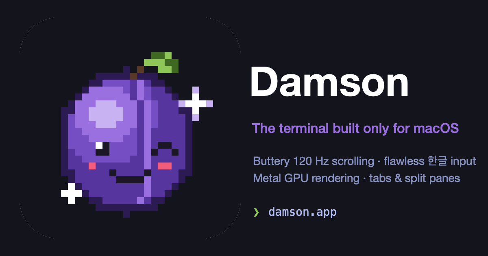

  

# Damson

**The terminal built only for macOS.**

No cross-platform compromises. Damson is written in Swift with Metal and CoreText, targeting exactly one platform — so scrolling glides the way it does in Safari, Korean input never drops a syllable, and every frame is drawn on the GPU. Things that should be a given in a Mac app, finally a given in a terminal.

  <a href="https://github.com/hulryung/damson/releases/latest"><b>Download the latest release (.dmg)</b></a> 
  macOS 13 Ventura or later · Notarized by Apple · Automatic updates built in

## Why Damson exists

There are plenty of good terminals, but most of them are cross-platform apps. Built on the lowest common denominator of Linux, Windows, and macOS, they always feel slightly off on a Mac: trackpad momentum scrolling stutters, the first letter vanishes when you start typing Korean, and system shortcuts and menus don't behave like the rest of your apps.

Damson starts from the opposite end: **it will never support any platform other than macOS.** In exchange, it uses ProMotion 120 Hz displays, the Korean IME, trackpad gestures, and native menus directly — no abstraction layer in between. The goal isn't "surprisingly smooth for a terminal." It's **a well-made Mac app that happens to be a terminal.**

## What makes it different

- **Scrolling feels like a Mac.** ProMotion 120 Hz, per-pixel scrolling, momentum and rubber-banding — the same feel as scrolling a web page in Safari.
- **Korean input just works.** Type as fast as you like; the first jamo never disappears and compositions never tangle. We tracked down the subtle timing races in the macOS Korean IME and fixed them, and in-progress compositions render right where they belong.
- **The GPU draws everything.** The Metal renderer handles truecolor, bold/underline/strikethrough/hyperlinks, double-width CJK, and color emoji (including ZWJ sequences and flags). Symbols your font lacks — like ④ — still show up through font fallback.
- **The fundamentals of an all-day tool.** Tabs and split panes (split, rearrange, switch), a settings UI, session restore that brings everything back when you relaunch, Sparkle auto-updates, and a `damson-cli` for scripted control.

## Who it's for

- **Developers who keep a terminal open all day on macOS.** If it's the window you stare at the longest, it should be the best-made window you own.
- **Developers who work in Korean.** Commit messages, chat, docs — you shouldn't have to brace yourself every time you type 한글 in a terminal.
- **People running CLI AI coding agents.** If you keep agents like Claude Code running across several panes, smooth rendering under fast output streams and rock-solid splits make a difference you can feel.
- **People who won't give up the native Mac feel.** If you expect system shortcuts, menus, and gestures to work exactly like every other Mac app.

## Download

Grab the latest `.dmg` from [GitHub Releases](https://github.com/hulryung/damson/releases/latest) and drop it into Applications. From then on the app keeps itself up to date (Sparkle).

- Requires macOS 13 Ventura or later
- Developer ID signed and notarized by Apple

Damson is in active beta. The developer uses it as their daily-driver terminal and polishes it through daily dogfooding.

## Embedding Damson in your app

Damson's engine ships as a Swift Package, `DamsonTerminal` — the same VT parser, grid, and Metal renderer the app uses, available as a library so you can put a terminal view inside your own macOS app. See [docs/ARCHITECTURE.md](docs/ARCHITECTURE.md) for details.

## Learn more

If you're curious about the internals:

- [docs/ARCHITECTURE.md](docs/ARCHITECTURE.md) — overall architecture and module layout
- [docs/METAL-RENDERER-PLAN.md](docs/METAL-RENDERER-PLAN.md) — design and build-out of the Metal renderer
- [docs/SMOOTH-SCROLL.md](docs/SMOOTH-SCROLL.md) — the concrete recipe for guaranteed-smooth scrolling
- [docs/KOREAN-IME.md](docs/KOREAN-IME.md) — root-cause analysis and fix for the Korean first-jamo race
- [docs/KOREAN-FONT-CASCADE.md](docs/KOREAN-FONT-CASCADE.md) — Korean font fallback design
