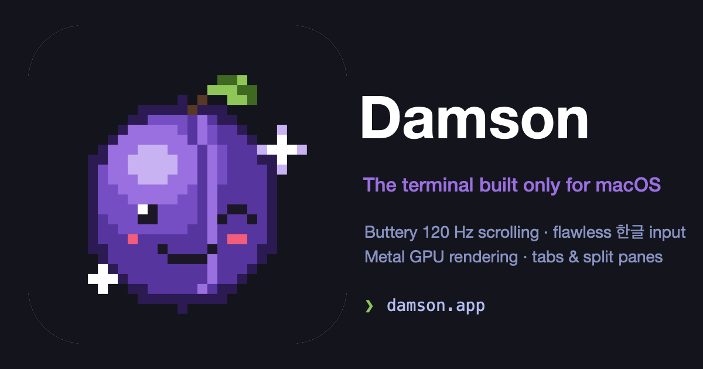

<p align="center">
  
</p>

# Damson

**The terminal built only for macOS.**

No cross-platform compromises. Damson is written in Swift with Metal and CoreText, targeting exactly one platform — so scrolling glides the way it does in Safari, Korean input never drops a syllable, and every frame is drawn on the GPU. Things that should be a given in a Mac app, finally a given in a terminal.

<p align="center">
  <a href="https://github.com/hulryung/damson/releases/latest"><b>Download the latest release (.dmg)</b></a><br>
  macOS 13 Ventura or later · Notarized by Apple · Automatic updates built in
</p>

## Why Damson exists

There are plenty of good terminals, but most of them are cross-platform apps. Built on the lowest common denominator of Linux, Windows, and macOS, they always feel slightly off on a Mac: trackpad momentum scrolling stutters, the first letter vanishes when you start typing Korean, and system shortcuts and menus don't behave like the rest of your apps.

Damson starts from the opposite end: **it will never support any platform other than macOS.** In exchange, it uses ProMotion 120 Hz displays, the Korean IME, trackpad gestures, and native menus directly — no abstraction layer in between. The goal isn't "surprisingly smooth for a terminal." It's **a well-made Mac app that happens to be a terminal.**

## What makes it different

- **Scrolling feels like a Mac.** ProMotion 120 Hz, per-pixel scrolling, momentum and rubber-banding — the same feel as scrolling a web page in Safari.
- **Korean input just works.** Type as fast as you like; the first jamo never disappears and compositions never tangle. We tracked down the subtle timing races in the macOS Korean IME and fixed them, and in-progress compositions render right where they belong.
- **The GPU draws everything.** The Metal renderer handles truecolor, bold/underline/strikethrough/hyperlinks, double-width CJK, and color emoji (including ZWJ sequences and flags). Symbols your font lacks — like ④ — still show up through font fallback.
- **The fundamentals of an all-day tool.** Tabs and split panes (split, rearrange, switch), a settings UI, session restore that brings everything back when you relaunch, Sparkle auto-updates, and a `damson-cli` for scripted control.

## Who it's for

- **Developers who keep a terminal open all day on macOS.** If it's the window you stare at the longest, it should be the best-made window you own.
- **Developers who work in Korean.** Commit messages, chat, docs — you shouldn't have to brace yourself every time you type 한글 in a terminal.
- **People running CLI AI coding agents.** If you keep agents like Claude Code running across several panes, smooth rendering under fast output streams and rock-solid splits make a difference you can feel.
- **People who won't give up the native Mac feel.** If you expect system shortcuts, menus, and gestures to work exactly like every other Mac app.

## Download

Grab the latest `.dmg` from [GitHub Releases](https://github.com/hulryung/damson/releases/latest) and drop it into Applications. From then on the app keeps itself up to date (Sparkle).

- Requires macOS 13 Ventura or later
- Developer ID signed and notarized by Apple

Damson is in active beta. The developer uses it as their daily-driver terminal and polishes it through daily dogfooding.

## Running AI agents in Damson

Damson can open, label and observe panes running Anthropic's `claude`, and there's a Claude
Code skill that teaches Claude how to drive it. Ask for "a tab per task" and you get one
labelled tab per piece of work, grouped so the whole run folds or closes as a unit — and a
notification when one of them is blocked waiting on you.

```sh
claude plugin marketplace add hulryung/damson
claude plugin install damson-orchestration@damson
```

Damson is a terminal emulator, so its repository is large. If you'd rather not have all of it
checked out for one skill, take just the plugin (about 250 KB):

```sh
claude plugin marketplace add hulryung/damson --sparse .claude-plugin plugins
```

The skill drives two command-line tools that ship inside the app, at
`Damson.app/Contents/Resources/`. Link them onto your `PATH` — `install-local.sh` does this
for you, or by hand:

```sh
sudo ln -sf /Applications/Damson.app/Contents/Resources/damson-cli  /usr/local/bin/
sudo ln -sf /Applications/Damson.app/Contents/Resources/damson-crew /usr/local/bin/
```

`damson-cli` addresses panes one at a time; `damson-crew` runs a whole list of tasks and
waits for the one that needs you:

```sh
damson-crew run    --tasks tasks.json --group refactor
damson-crew watch  --tasks tasks.json --notify --focus
damson-crew close  --group refactor --yes
```

`tasks.json` is just a list. Each `name` becomes the tab's label, so you can tell the run
apart at a glance. Give a task a `repo` instead of a `cwd` and a git worktree is made for it:

```json
[
  {"name": "review-api", "cwd": "~/dev/api", "prompt": "review the auth changes"},
  {"name": "fix-parser", "repo": "~/dev/core", "branch": "agent/fix-parser",
   "prompt": "fix the failing parser tests", "command": ["codex"]}
]
```

**It is not tied to Claude.** Worktree support is per-tool and inconsistent — `claude -w`,
`grok --worktree=<name>`, nothing at all in `codex` or `cursor-agent` — so damson-crew makes
the worktree itself and starts the agent in it. The prompt is appended as the last argument,
which `claude`, `codex`, `grok` and `cursor-agent` all accept; a tool that wants it behind a
flag takes `{prompt}` in its `command`.

`close --remove-worktrees` tidies them up afterwards, and **never forces**: git refuses to
remove a worktree holding uncommitted or untracked files, and that refusal is reported rather
than worked around. Teardown cannot destroy an agent's unsaved work.

Agents run with `--dangerously-skip-permissions` by default, so a task runs through instead
of stopping to ask — an agent waiting on an approval is the most common way a run stalls.
That does mean agents edit files and run commands without asking; **Settings → Agents** turns
it off, along with the default agent, the notification behaviour, and where worktrees go.

One caveat worth knowing before you plan around it: **the watching half is Claude-only.**
`watch --notify` works by joining a pane to Claude Code's own session records, so agents from
other tools open, get labelled and grouped, and run — but never raise a "blocked on you"
alert, because nothing publishes that state.

**What this deliberately isn't:** a queue. Claude Code has no completion signal for a session
running in a terminal, so nothing here decides a task is finished and starts the next one.
It fans work out and routes your attention to whichever agent is stuck — the judgement stays
with you. [docs/CLAUDE-ORCHESTRATION.md](docs/CLAUDE-ORCHESTRATION.md) has the measurements
behind that, and everything else that was tried and rejected.

## Embedding Damson in your app

Damson's engine ships as a Swift Package, `DamsonTerminal` — the same VT parser, grid, and Metal renderer the app uses, available as a library so you can put a terminal view inside your own macOS app. See [docs/ARCHITECTURE.md](docs/ARCHITECTURE.md) for details.

## Learn more

If you're curious about the internals:

- [docs/ARCHITECTURE.md](docs/ARCHITECTURE.md) — overall architecture and module layout
- [docs/METAL-RENDERER-PLAN.md](docs/METAL-RENDERER-PLAN.md) — design and build-out of the Metal renderer
- [docs/SMOOTH-SCROLL.md](docs/SMOOTH-SCROLL.md) — the concrete recipe for guaranteed-smooth scrolling
- [docs/KOREAN-IME.md](docs/KOREAN-IME.md) — root-cause analysis and fix for the Korean first-jamo race
- [docs/KOREAN-FONT-CASCADE.md](docs/KOREAN-FONT-CASCADE.md) — Korean font fallback design
- [docs/CLAUDE-ORCHESTRATION.md](docs/CLAUDE-ORCHESTRATION.md) — running agents in panes, and where that stops
